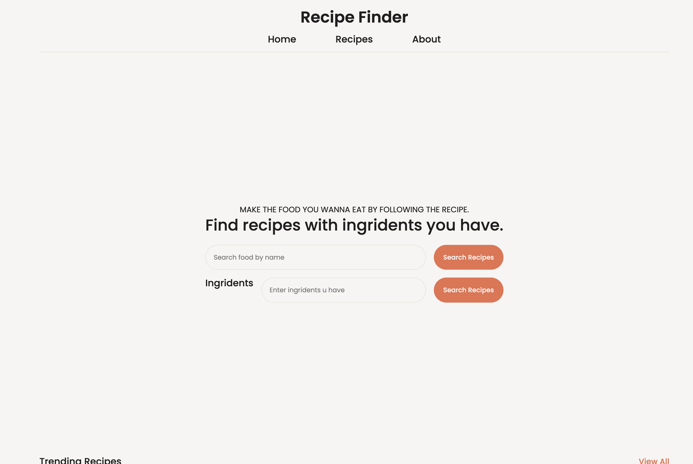

# Recipe Finder
A small recipe finder webapp to learn about api.

## Features
- Responsive
- Search recipes
- Browse recipes
- View recipies
- clean design

## vierw site
- search [https://rojen-recipe-finder.netlify.app/](https://rojen-recipe-finder.netlify.app/)

or
- clone the code from [https://github.com/rojen-chakradhar/recipe-finder](https://github.com/rojen-chakradhar/recipe-finder)
and host it on your device

###### I used copilot a bit for lil logic.